# Owner-short YOLO 200/96 A/B 与小周期扫描

状态：机器验收通过。以下图片均为模型保存的原始预测框，不是后处理重建框。

## 结论先说

- 相同训练合同下，96 根明显优于 200 根：mAP50 `0.548 vs 0.339`，mAP50-95
  `0.195 vs 0.091`。
- 96 根显著降低了“框贴最右侧”捷径，但没有根除；2m/3m/5m 的框右界中位数仍约 `0.91`。
- 抽样里既能看到两个窗口检测同一时间区域，也有框覆盖下跌后的整理段，未必符合你心中的
  “均线密集启动”。因此现在不能说模型已经可用。
- 本轮没有收益标签，没有读取 holdout，没有调阈值，也没有验证 15m/30m 正期望。

## 训练验证

| 窗口 | best epoch | Precision | Recall | mAP50 | mAP50-95 |
|---|---:|---:|---:|---:|---:|
| w200 | 10 | 0.325 | 0.479 | 0.339 | 0.091 |
| w96 | 11 | 0.588 | 0.505 | 0.548 | 0.195 |

w200 在 best epoch 之后明显退化，最后一轮 mAP50-95 只有 `0.00061`；扫描使用的是已保存的
`best.pt`。w96 最后一轮 mAP50-95 为 `0.13517`，训练仍有波动，但比 w200 稳定。

## 固定阈值离线扫描

阈值固定为 `conf=0.30`、`iou=0.70`，每组 512 张图。

| 窗口 | 周期 | 币种数 | 命中图 | 检测框 | 置信度中位 | 框右界中位 | 右界≥0.95 |
|---|---|---:|---:|---:|---:|---:|---:|
| w200 | 1m | 1 | 18 | 19 | 0.420 | 0.953 | 52.6% |
| w96 | 1m | 1 | 20 | 20 | 0.370 | 0.828 | 10.0% |
| w200 | 2m | 18 | 54 | 66 | 0.417 | 0.953 | 62.1% |
| w96 | 2m | 18 | 40 | 48 | 0.383 | 0.911 | 16.7% |
| w200 | 3m | 2 | 72 | 96 | 0.419 | 0.953 | 59.4% |
| w96 | 3m | 2 | 40 | 46 | 0.384 | 0.911 | 41.3% |
| w200 | 5m | 14 | 102 | 124 | 0.405 | 0.914 | 49.2% |
| w96 | 5m | 14 | 48 | 53 | 0.439 | 0.911 | 26.4% |

注意：1m 只有 ETH，3m 只有 BTC/ETH，不同周期的绝对检测数不能直接横向排名。

## 手机抽样画廊

每组上图为 w200，下图为 w96；左右窗口终点相同。

### 1m 样本 1

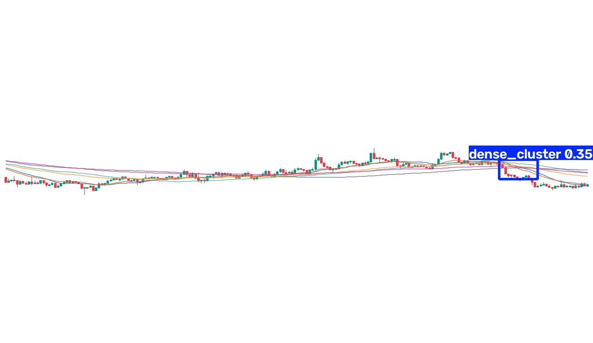

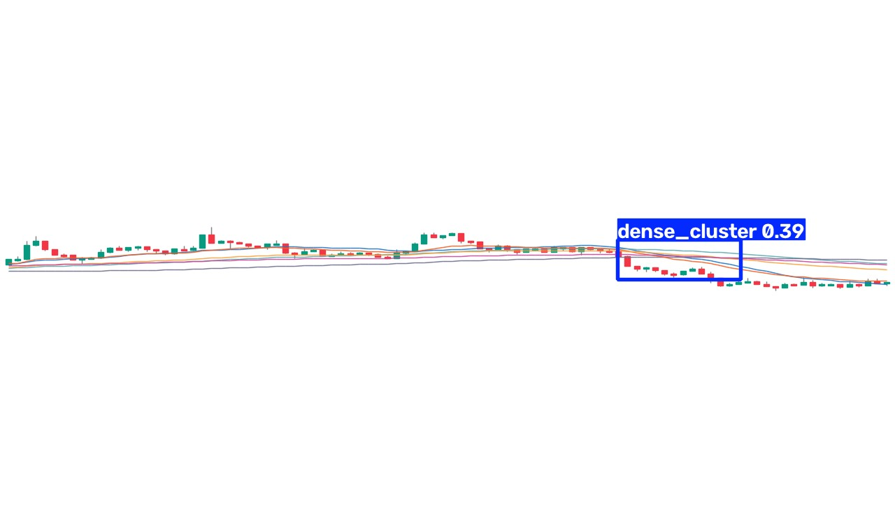

### 1m 样本 2

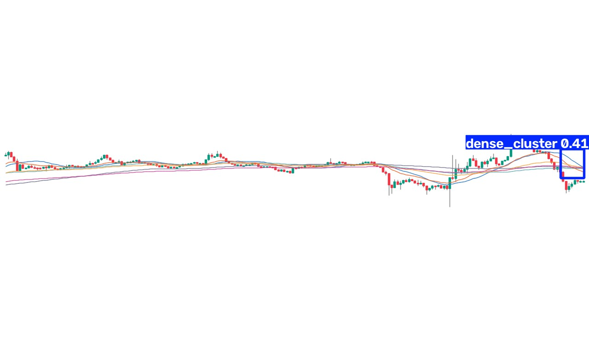

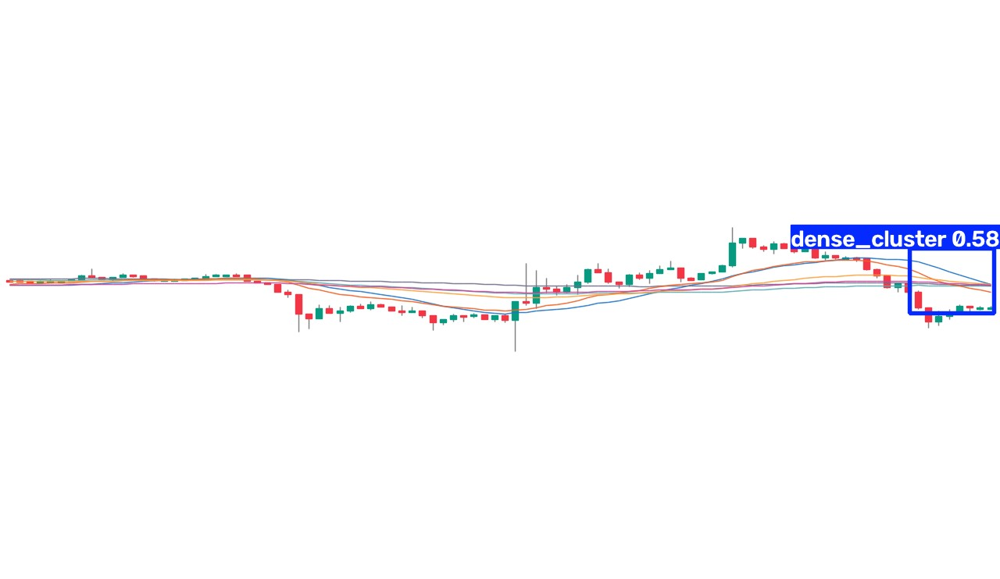

### 2m 样本 1

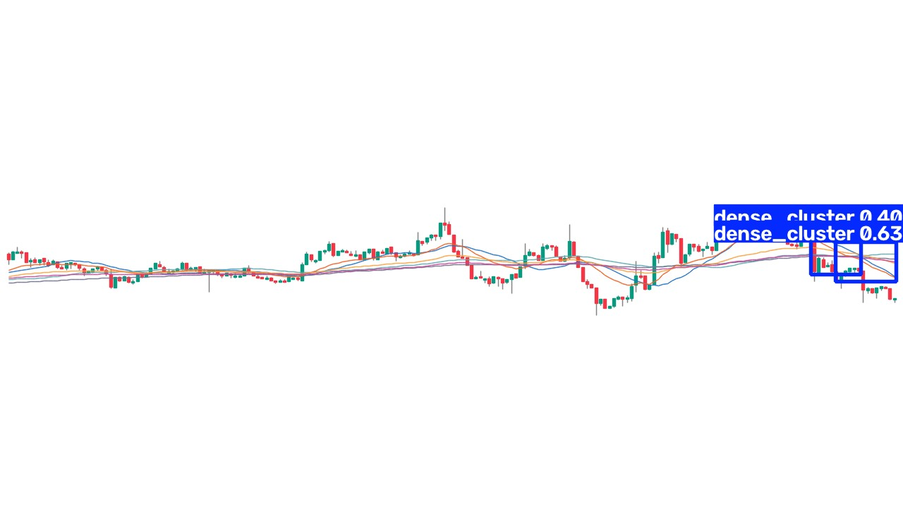

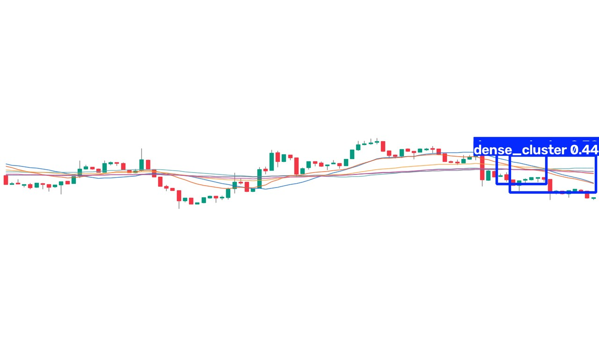

### 2m 样本 2

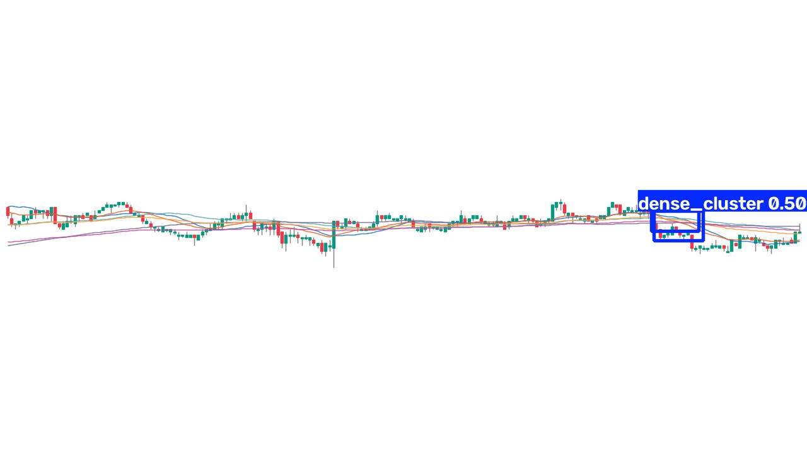

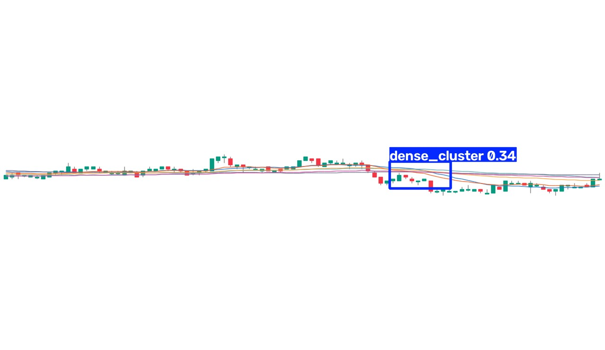

### 3m 样本 1

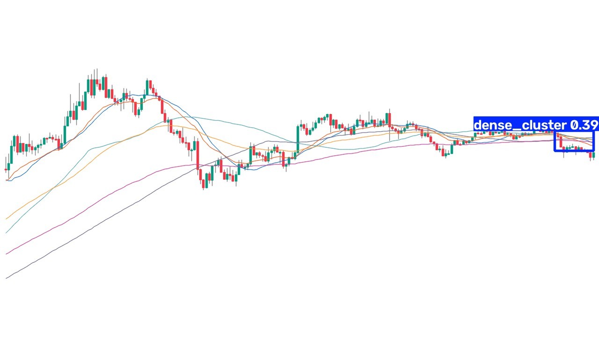

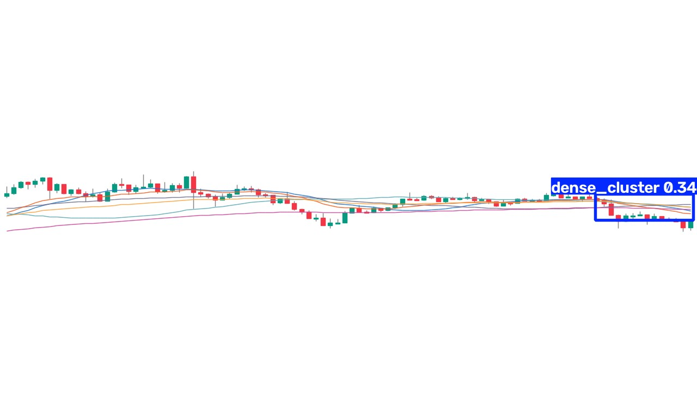

### 3m 样本 2

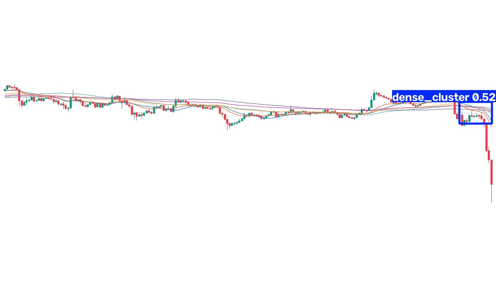

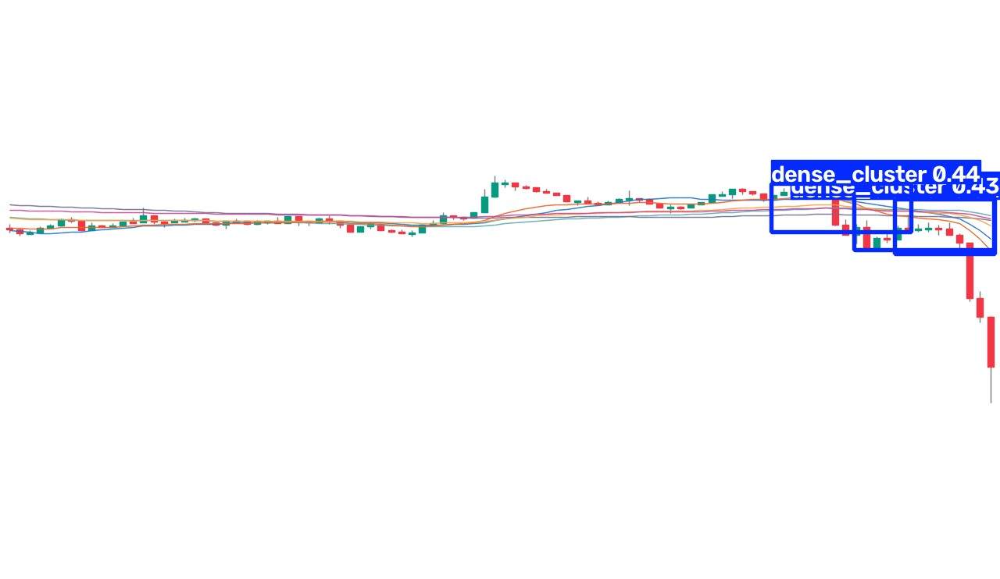

### 5m 样本 1

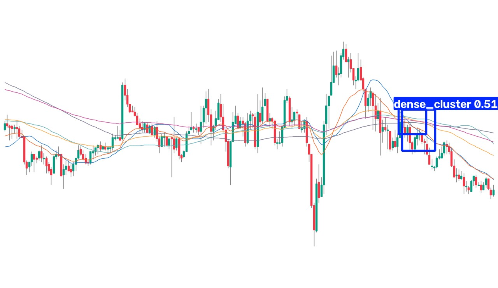

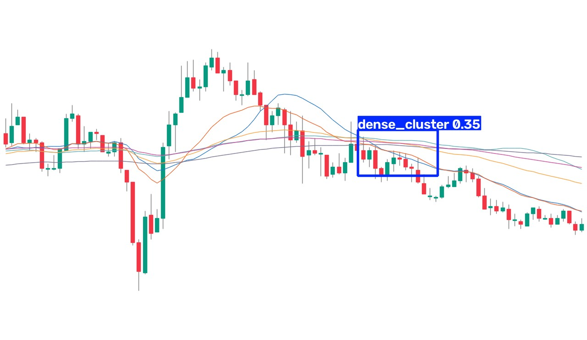

### 5m 样本 2

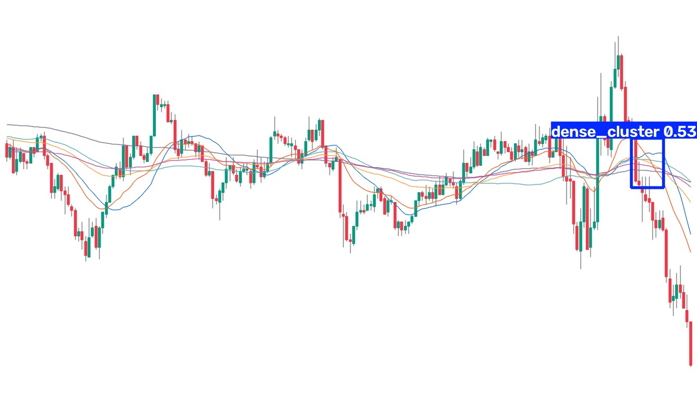

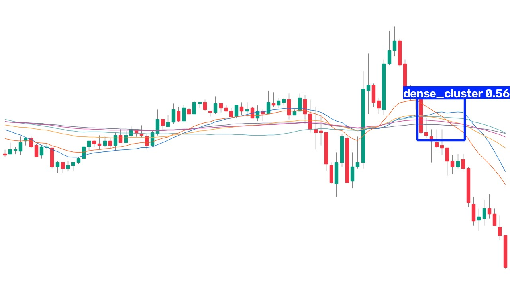

## 安全边界

- `holdout_read=false`
- `threshold_tuned=false`
- `ACTIVE` 未修改
- 未部署、未下单

机器可读明细见 [MICRO_SCAN_SUMMARY_20260804.json](MICRO_SCAN_SUMMARY_20260804.json)。
